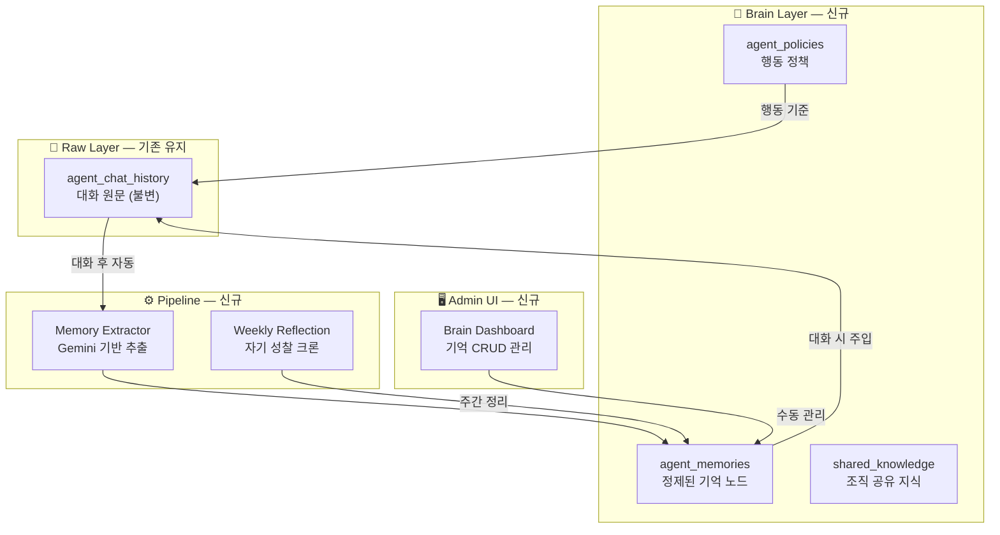

# 🧠 에이전트 장기 기억 시스템 — 전체 구현 완료 워크스루

## 프로젝트 목표

P-Reinforce 아키텍처 철학을 5명의 AI 에이전트에 적용하여, 대화할수록 성장하고 과거를 잊지 않는 **살아있는 직원**으로 진화시키는 것.

---

## 아키텍처 개요



---

## 변경 파일 목록

### 신규 파일 (3개)

| 파일 | 역할 |
|------|------|
| [agent-brain.js](file:///c:/Users/tube1/Projects/%EC%97%AC%ED%96%89%20%EB%A0%8C%ED%83%88%20%EB%B9%84%EC%A6%88%EB%8B%88%EC%8A%A4/api/_lib/agent-brain.js) | 🧠 핵심 엔진 — DB 테이블, 기억 추출/저장/검색, 프롬프트 빌더 |
| [agent-brain.js (API)](file:///c:/Users/tube1/Projects/%EC%97%AC%ED%96%89%20%EB%A0%8C%ED%83%88%20%EB%B9%84%EC%A6%88%EB%8B%88%EC%8A%A4/api/agent-brain.js) | 📡 CRUD 엔드포인트 — 기억 조회/추가/삭제/아카이브 |
| [weekly-reflection.js](file:///c:/Users/tube1/Projects/%EC%97%AC%ED%96%89%20%EB%A0%8C%ED%83%88%20%EB%B9%84%EC%A6%88%EB%8B%88%EC%8A%A4/api/cron/weekly-reflection.js) | 🔄 주간 자기 성찰 크론 — 중복 병합, 모순 감지, 디스코드 보고 |

### 수정 파일 (5개)

| 파일 | 변경 내용 |
|------|----------|
| [agent-chat.js](file:///c:/Users/tube1/Projects/%EC%97%AC%ED%96%89%20%EB%A0%8C%ED%83%88%20%EB%B9%84%EC%A6%88%EB%8B%88%EC%8A%A4/api/agent-chat.js) | 기억 주입 + 추출 파이프라인 연결 |
| [admin.html](file:///c:/Users/tube1/Projects/%EC%97%AC%ED%96%89%20%EB%A0%8C%ED%83%88%20%EB%B9%84%EC%A6%88%EB%8B%88%EC%8A%A4/admin.html) | 🧠 버튼 + Brain Dashboard 모달 HTML |
| [admin.js](file:///c:/Users/tube1/Projects/%EC%97%AC%ED%96%89%20%EB%A0%8C%ED%83%88%20%EB%B9%84%EC%A6%88%EB%8B%88%EC%8A%A4/admin.js) | Brain Dashboard JS 로직 (~210줄 추가) |
| [styles.css](file:///c:/Users/tube1/Projects/%EC%97%AC%ED%96%89%20%EB%A0%8C%ED%83%88%20%EB%B9%84%EC%A6%88%EB%8B%88%EC%8A%A4/styles.css) | Brain Dashboard CSS (~330줄 추가) |
| [vercel.json](file:///c:/Users/tube1/Projects/%EC%97%AC%ED%96%89%20%EB%A0%8C%ED%83%88%20%EB%B9%84%EC%A6%88%EB%8B%88%EC%8A%A4/vercel.json) | 주간 크론 등록 (월요일 09:00 KST) |

---

## 3가지 성장 메커니즘

### 🌱 자연 성장 (매 대화)
```
대화 → Gemini가 핵심 기억 자동 추출 → DB 저장 → 다음 대화에 자동 주입
```

### 📚 명시적 교육 (Admin Dashboard)
```
사장님이 Brain Dashboard에서 직접 기억 추가/수정/삭제
```

### 🪞 자기 성찰 (주간 크론)
```
매주 월요일 → 중복 병합 + 모순 감지 + 오래된 기억 아카이브 + 중요도 자동 조정
→ 디스코드에 성찰 보고서 발송
```

---

## 테스트 결과

| 항목 | 결과 |
|------|------|
| `agent-brain.js` 엔진 모듈 로드 | ✅ 11개 함수 정상 export |
| `agent-brain.js` API 로드 | ✅ |
| `weekly-reflection.js` 크론 로드 | ✅ |
| `agent-chat.js` 통합 로드 | ✅ |
| Vercel 프로덕션 배포 (2회) | ✅ |
| 지오 에이전트 대화 | ✅ 정상 응답 |
| Brain Dashboard 모달 열기 | ✅ |
| 기억 추가 폼 UI | ✅ |

---

## Brain Dashboard 스크린샷


